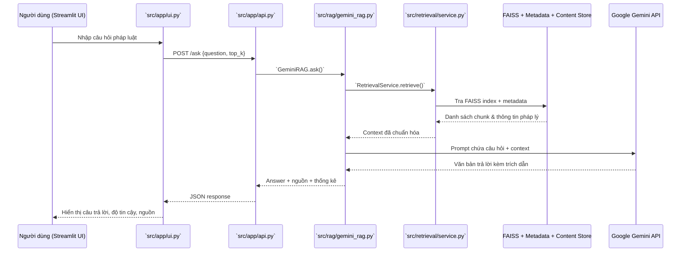

# Kiến trúc hệ thống LegalAdvisor

LegalAdvisor hiện thực hoá pipeline Retrieval-Augmented Generation (RAG) để trả lời câu hỏi pháp luật tiếng Việt. Tài liệu này mô tả các thành phần chính, luồng xử lý và cách dữ liệu được tổ chức trong dự án.

## Nguyên tắc thiết kế
- **Tách chức năng rõ ràng**: Retrieval, sinh câu trả lời và giao diện được tách thành các module riêng.
- **Triển khai đơn giản**: `launcher.py` gom logic kiểm tra môi trường, khởi động API + UI và giám sát health-check.
- **Cấu hình linh hoạt**: Mọi đường dẫn và hành vi quan trọng đều có thể điều chỉnh qua biến môi trường.
- **Khả năng mở rộng**: Có thể thay thế hoặc bổ sung mô hình generator mà không ảnh hưởng tới API/UI.

## Luồng xử lý truy vấn

## Thành phần chính
- **`src/retrieval/service.py` – RetrievalService***
  - Nạp FAISS index (`models/retrieval/faiss_index.bin`) và metadata (`metadata.json`).
  - Mã hoá truy vấn bằng SentenceTransformer (hỗ trợ GPU qua `LEGALADVISOR_USE_GPU`).
  - Lấy nội dung pháp luật từ `data/processed/smart_chunks_stable.db` hoặc `smart_chunks_stable.parquet`.
- **`src/rag/gemini_rag.py` – GeminiRAG***
  - Gọi `RetrievalService`, format lại ngữ cảnh (Điều/Khoản/Điểm) và gửi prompt tới `gemini-2.0-flash-exp`.
  - Ghép block “Tài liệu tham khảo” theo thứ tự nguồn trả về.
- **`src/app/api.py` – FastAPI backend***
  - Cung cấp endpoints: `/health`, `/health/details`, `/ask`, `/stats`, `/sources/{chunk_id}`, `/debug/reinit`.
  - Áp dụng rate limit dựa trên `LEGALADVISOR_RATE_LIMIT_MAX` & `LEGALADVISOR_RATE_LIMIT_WINDOW`.
- **`src/app/ui.py` – Streamlit UI***
  - Kiểm tra health API trước khi cho phép đặt câu hỏi.
  - Cho phép xem nội dung chi tiết từng nguồn qua `/sources/{chunk_id}`.
- **`launcher.py` – Orchestrator***
  - Kiểm tra môi trường (Python, GPU, dữ liệu, index) và khởi động API + UI trong hai tiến trình.
  - Đợi `/health` sẵn sàng, hiển thị điểm truy cập và xử lý tín hiệu dừng.

## Cấu trúc thư mục trọng yếu
```text
LegalAdvisor/
data/
    processed/
        smart_chunks_stable.db
        smart_chunks_stable.parquet
models/
    retrieval/
        faiss_index.bin
        metadata.json
        model_info.json
src/
    app/
    rag/
    retrieval/
    utils/
tests/
    test_rate_limit.py
launcher.py
docs/
```
## Biến môi trường & cấu hình chính
- `GOOGLE_API_KEY`: Bắt buộc để API có thể khởi tạo Gemini.
- `LEGALADVISOR_USE_GPU`: `1` để cho phép sử dụng GPU trong retrieval/embedding.
- `LEGALADVISOR_MODELS_DIR`: Ghi đè đường dẫn `models/retrieval/` (dùng khi triển khai tách rời).
- `LEGALADVISOR_DATA_DIR`: Ghi đè thư mục chứa dữ liệu `data/processed/`.
- `LEGALADVISOR_RATE_LIMIT_MAX` & `LEGALADVISOR_RATE_LIMIT_WINDOW`: Điều chỉnh rate limit.
- `LEGALADVISOR_SKIP_RAG_INIT`: `1` để bỏ qua khởi tạo nền khi chạy test.

## Quy trình cập nhật dữ liệu/index
1. **Chuẩn bị dữ liệu**: Cập nhật `smart_chunks_stable.db` hoặc `smart_chunks_stable.parquet` trong `data/processed/`.
2. **Xây index mới**: Chạy `python src/retrieval/build_index.py` (có thể bật GPU).
3. **Triển khai**: Sao chép `faiss_index.bin`, `metadata.json`, `model_info.json` mới vào `models/retrieval/` trước khi khởi động API/UI.

## Giám sát & kiểm thử
- **Health-check**: `/health` và `/health/details` phản ánh trạng thái khởi tạo GeminiRAG.
- **Logging**: `src/utils/logger.py` ghi log định dạng thống nhất vào `logs/legaladvisor_YYYYMMDD.log`.
- **Testing**: Chạy `pytest` để xác nhận cơ chế rate limit và chuẩn bị mở rộng test trong tương lai.
