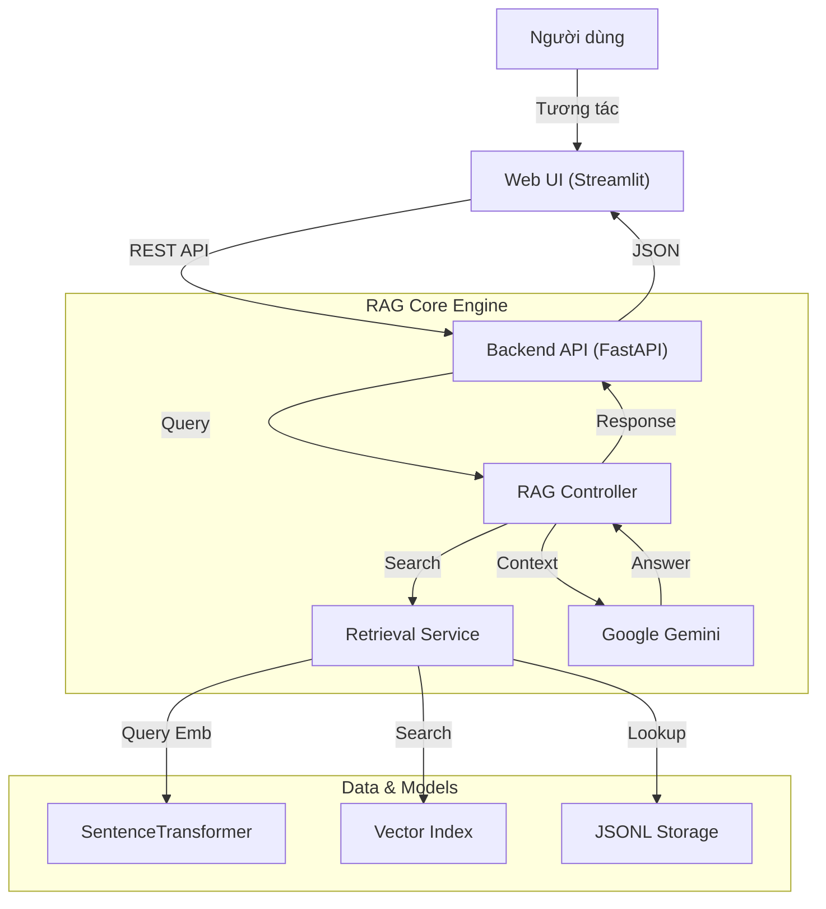

# Kiến trúc hệ thống LegalAdvisor

Tài liệu này mô tả kiến trúc kỹ thuật của **LegalAdvisor v1.0**, hệ thống RAG (Retrieval-Augmented Generation) chuyên biệt cho pháp luật Việt Nam.

## 1. Tổng quan hệ thống

Hệ thống hoạt động theo mô hình **Client-Server**, tích hợp các thành phần xử lý ngôn ngữ tự nhiên hiện đại:



## 2. Luồng xử lý dữ liệu (Data Pipeline)

Dữ liệu pháp luật trải qua quy trình xử lý nghiêm ngặt trước khi đưa vào hệ thống:

1.  **Raw Data (Zalo Legal)**: Dữ liệu thô từ cuộc thi Zalo AI Challenge.
2.  **Preprocessing (`src/data_preprocessing`)**:
    *   Làm sạch văn bản, chuẩn hóa unicode.
    *   Trích xuất metadata (Số hiệu, Loại văn bản, Cơ quan ban hành).
3.  **Chunking**: Chia nhỏ văn bản theo cấp độ **Điều luật** (Article-level chunking). Đây là đơn vị ngữ nghĩa tốt nhất cho pháp luật.
4.  **Embedding & Indexing**:
    *   Sử dụng mô hình `SentenceTransformer` (mặc định: `intfloat/multilingual-e5-small` fine-tuned) để chuyển text thành vector.
    *   Lưu trữ vector vào **FAISS Index** (`models/retrieval/index_v2`).
    *   Lưu trữ nội dung text vào **JSONL** (`data/processed/zalo-legal/chunks_schema.jsonl`).

## 3. Chi tiết các thành phần

### A. Retrieval Service (`src/retrieval`)
Chịu trách nhiệm tìm kiếm các văn bản luật liên quan nhất.
*   **Input**: Câu hỏi của người dùng.
*   **Process**:
    1.  Mã hóa câu hỏi thành vector.
    2.  Tìm kiếm K vector gần nhất trong FAISS.
    3.  Map từ ID vector sang nội dung văn bản luật đầy đủ từ JSONL storage.
    4.  Sử dụng thuật toán tối ưu bộ nhớ (loading indexed cache) để truy xuất cực nhanh (O(1)).

### B. RAG Engine (`src/rag`)
Bộ não của hệ thống, kết hợp thông tin tìm kiếm được để sinh câu trả lời.
*   **Model**: Google Gemini (Flash/Pro variants).
*   **Logic**:
    *   Xây dựng Prompt chứa: Vai trò chuyên gia pháp lý + Câu hỏi + Các đoạn luật tìm thấy (Context).
    *   Yêu cầu model trả lời dựa *chỉ* trên context được cung cấp để tránh ảo giác (hallucination).
    *   Format đầu ra kèm trích dẫn nguồn.

### C. API Backend (`src/app/api.py`)
*   Framework: **FastAPI**.
*   Tính năng:
    *   Rate Limiting (chống spam).
    *   Logging & Monitoring.
    *   Endpoints: `/ask` (hỏi đáp), `/sources/{id}` (xem nguồn), `/health` (kiểm tra hệ thống).

## 4. Cấu trúc thư mục

```text
LegalAdvisor/
├── data/                   # Dữ liệu
│   └── processed/
│       └── zalo-legal/     # Dữ liệu đã xử lý (JSONL + Schema)
├── models/                 # Models & Index
│   └── retrieval/
│       └── index_v2/       # FAISS Index & Metadata
├── src/                    # Source code chính
│   ├── app/                # API & UI
│   ├── rag/                # Logic RAG & Gemini
│   ├── retrieval/          # Logic tìm kiếm & Embedding
│   └── utils/              # Tiện ích chung
├── scripts/                # Các script công cụ (benchmark, test)
├── tests/                  # Unit & Integration tests
└── launcher.py             # Script khởi động hệ thống
```

## 5. Mở rộng & Bảo trì

*   **Cập nhật dữ liệu**: Chỉ cần chạy lại pipeline tiền xử lý và script `build_index.py` để cập nhật luật mới.
*   **Thay đổi Model**: Hệ thống thiết kế dạng modular, dễ dàng thay thế SentenceTransformer hoặc LLM khác (như OpenAI, Anthropic) mà không ảnh hưởng logic cốt lõi.
