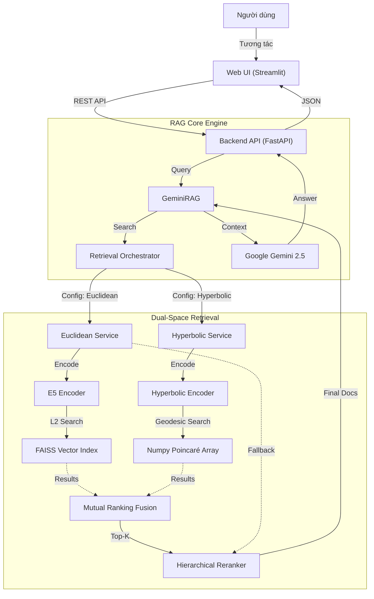

# Kiến trúc hệ thống LegalAdvisor

Tài liệu này mô tả kiến trúc kỹ thuật của **LegalAdvisor v1.0**, hệ thống RAG (Retrieval-Augmented Generation) chuyên biệt cho pháp luật Việt Nam. 
Phiên bản hiện tại đã được nâng cấp lên kiến trúc **HyperbolicRAG Dual-Space** để bắt chính xác cấu trúc phân cấp (Hierarchy) của văn bản luật.

## 1. Tổng quan hệ thống

Hệ thống hoạt động theo mô hình **Client-Server**, sử dụng mô hình Giao thoa Không gian (Dual-Space Mutual Ranking Fusion) hiện đại:


```mermaid
graph TD
    User[Người dùng] -->|Tương tác| UI["Web UI (Streamlit)"]
    UI -->|REST API| API["Backend API (FastAPI)"]
    
    subgraph "RAG Core Engine"
        API -->|Query| RAG[GeminiRAG]
        RAG -->|Search| Orch[Retrieval Orchestrator]
        RAG -->|Context| LLM[Google Gemini 2.5]
    end
    
    subgraph "Dual-Space Retrieval"
        Orch -->|Config: Euclidean| EucSer[Euclidean Service]
        Orch -->|Config: Hyperbolic| HypSer[Hyperbolic Service]
        
        EucSer -->|Encode| E5[E5 Encoder]
        E5 -->|L2 Search| FAISS[FAISS Vector Index]
        
        HypSer -->|Encode| Poincare[Hyperbolic Encoder]
        Poincare -->|Geodesic Search| Numpy[Numpy Poincaré Array]
        
        FAISS -.->|Results| Fusion[Mutual Ranking Fusion]
        Numpy -.->|Results| Fusion
        
        Fusion -->|Top-K| Reranker[Hierarchical Reranker]
        EucSer -.->|Fallback| Reranker
    end
    
    Reranker -->|Final Docs| RAG
    LLM -->|Answer| API
    API -->|JSON| UI
```

## 2. Luồng xử lý dữ liệu (Data Pipeline)

Dữ liệu pháp luật trải qua quy trình xử lý trước khi đưa vào hệ thống:

1.  **Raw Data**: Dữ liệu thô từ Zalo AI Legal.
2.  **Preprocessing (`src/data_preprocessing/`)**:
    *   Làm sạch và chia nhỏ (Chunking) theo cấp độ **Điều luật**.
    *   Xây dựng cây phân cấp (Hierarchy Tree) từ Văn Bản -> Chương -> Mục -> Điều.
3.  **Embedding & Indexing (Dual-Space)**:
    *   **Euclidean Space**: Dùng `intfloat/multilingual-e5-small` đổi text thành Vector tĩnh, nhúng vào FAISS.
    *   **Hyperbolic Space (Mới)**: Đồ thị hoá vector tĩnh thông qua Neural Network dự đoán Depth (độ sâu) và chọc vào Poincaré Ball bảo toàn cấu trúc bao hàm.
4.  **Retrieval Phase**:
    *   Thực hiện truy vấn trên 2 không gian độc lập. Khoảng cách Geodesic (arccosh) được tính trên Hyperbolic nhằm giải bài toán bão hoà điểm ảnh của FAISS L2.
    *   **MRF (Mutual Ranking Fusion)**: Trộn kết quả ở 2 không gian sinh *Consistency Bonus*.
    *   **Hierarchy Reranker**: Điều chỉnh điểm số sau chót nhằm phục vụ câu hỏi Tổng Quát vs Cụ Thể dựa trên `chunk_depths`. 

## 3. Chi tiết các thành phần

### A. Retrieval Orchestrator (`src/retrieval/orchestrator.py`)
Mặt tiền (Facade) điều phối phương thức tìm kiếm. Tự động chuyển đổi giữa `EuclideanRetrievalService` (chế độ thường) và `HyperbolicRetrievalService` (chế độ sâu) thông qua biến môi trường.

### B. Mạng Neural Poincaré (`src/retrieval/hyperbolic/`)
* **Encoder**: Ánh xạ đặc trưng Euclidean sang mặt phẳng cong Hyperbolic thông qua `geoopt.expmap0`.
* **Loss Function**: `HierarchicalContrastiveLoss`. Học tính bao hàm (Parent-Child) bằng Margin Triplet Loss. 
* **Metric Search**: Vectorized Numpy Arccosh cực nhanh. Thay thế hoàn toàn thuật toán L2 của FAISS.

### C. RAG Engine (`src/rag/`)
*   **Model**: Google Gemini API.
*   **Logic**:
    *   Xây dựng Prompt qua `_build_llm_context`. Fetch song song nội dung Top K văn bản luật qua ThreadPool.
    *   Ép Gemini bám vào Căn Cứ Pháp Lý, trích xuất chính xác nguồn dẫn chứng cho Frontend hiển thị.

### D. Centralized Config (`src/utils/config.py`)
* Loại bỏ toàn bộ hardcode `os.getenv`. 
* Quy hoạch cấu hình của Rate-limiter, Context Size, Hyperbolic Flag,... một cách nhất quán tại 1 điểm.

## 4. Cấu trúc thư mục

```text
LegalAdvisor/
├── data/                   # Dữ liệu (Raw + Processed)
├── models/                 # Chứa Weights & Indexes
│   └── retrieval/
│       ├── index_v2/           # FAISS Index (Euclidean)
│       ├── index_hyperbolic/   # Numpy Index (Poincaré)
│       └── hyperbolic_encoder/ # PyTorch Hyperbolic Weights
├── src/                    # Source code chính
│   ├── app/                # API (FastAPI) & UI (Streamlit)
│   ├── data_preprocessing/ # ETL Logic, Build Hierarchy
│   ├── rag/                # Gemini Integration, Prompt Builder
│   ├── retrieval/          # Orchestrator, Dual-Space Services
│   │   └── hyperbolic/     # Core thuật toán Non-Euclidean Geometry
│   └── utils/              # Cấu hình Global & Helpers
├── scripts/                
│   └── training/           # Scripts Huấn luyện mô hình
└── launcher.py             # Script khởi động all-in-one
```
